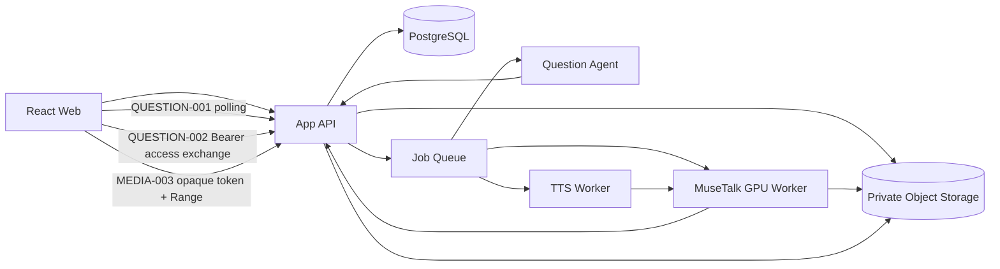
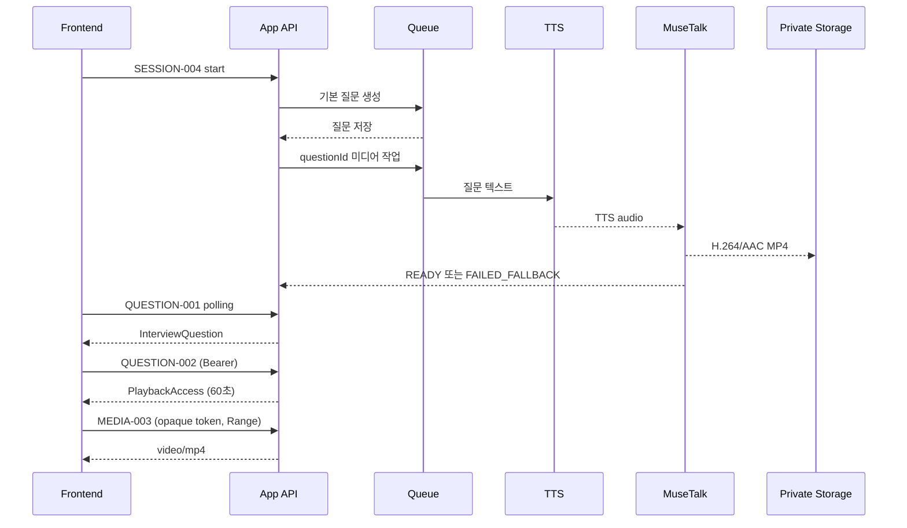

# MuseTalk 질문형 캐릭터 아키텍처

| 항목 | 내용 |
| --- | --- |
| 목적 | OpenAvatarChat·RTC 없이 질문 단위 TTS+MuseTalk MP4를 생성·재생하는 기술 구조를 정의한다. |
| 기준 API | [백엔드 API 명세서 v0.3.6](FaceFit_백엔드_API_명세서_v0.3.md) |
| 대상 독자 | 백엔드, AI, 프론트엔드, 인프라, QA, PM |
| 버전 | 1.0 |
| 최종 수정일 | 2026-07-31 |
| 상태 | V1 확정 구조 |

## 1. 범위와 원칙

- 지속 연결, WebSocket, WebRTC, TURN, 실시간 frame 전송을 사용하지 않는다.
- 백엔드는 질문 텍스트를 TTS 음성으로 합성하고 MuseTalk MP4를 생성한다.
- 프론트는 대기·듣기·로딩 반응을 정적 캐릭터와 CSS animation으로 표현한다.
- MuseTalk 실패가 면접 실패가 되지 않도록 정적 캐릭터+질문 텍스트 폴백을 제공한다.
- 질문·답변·분석 상태의 단일 기준은 App API다. AI worker는 DB에 직접 접근하지 않는다.

## 2. 상위 구조

## 3. 질문 출력 흐름

## 4. 상태 모델

| 상태 | 의미 | 프론트 처리 |
| --- | --- | --- |
| `QUEUED` | 미디어 작업 대기 | 정적 캐릭터·준비 문구 |
| `PROCESSING` | TTS 또는 MuseTalk 처리 | 정적 캐릭터·로딩 반응 |
| `READY` | MP4 재생 가능 | `QUESTION-002`로 `PlaybackAccess` 발급 후 `MEDIA-003` 재생 |
| `FAILED_FALLBACK` | 생성 실패 또는 20초 초과 | 정적 캐릭터+질문 텍스트로 진행 |

`nextQuestionStatus=READY`는 다음 질문 미디어가 `READY` 또는
`FAILED_FALLBACK`으로 확정된 뒤에만 반환한다.

## 5. 미디어 규격

| 항목 | 계약 |
| --- | --- |
| 컨테이너 | MP4 |
| Video | H.264 `avc1`, 최대 1280×720, 24fps |
| Audio | AAC-LC |
| 길이 | 질문당 최대 60초 |
| 조회 | 인증된 HTTPS streaming, `Range` 지원 |
| 캐시 | `private, max-age=300` |
| 저장 | Private Storage, Storage key 비노출 |
| 보존 | 세션 완료·중단 후 30일 |

## 6. 작업 멱등성과 폴백

- 작업 키는 `questionId + characterAssetVersion + ttsVersion + mediaVersion`이다.
- 같은 키의 성공 결과는 재사용하고 중복 GPU 작업을 만들지 않는다.
- 목표 처리시간 P95 10초, hard timeout 20초, 자동 재시도 최대 1회다.
- TTS 또는 MuseTalk 실패 시 `FAILED_FALLBACK`을 저장한다.
- 다시 듣기는 저장된 MP4를 재생하며 새 렌더 작업을 만들지 않는다.
- 기본 질문은 계획 완료 후 선생성할 수 있다. 꼬리질문은 결정 완료 후 생성한다.

## 7. 책임 경계

| 영역 | 프론트엔드 | App API | AI·미디어 Worker |
| --- | --- | --- | --- |
| 질문 상태 | polling·표시 | 현재 질문·상태 결정 | 질문 생성 결과 전달 |
| 캐릭터 반응 | 대기·듣기 CSS animation | 없음 | 없음 |
| 발화 영상 | `PlaybackAccess` 교환 후 MP4 재생 | opaque token·Range streaming | TTS·MuseTalk 생성 |
| 실패 | 폴백 UI | 오류·상태 저장 | 실패 코드 반환 |
| 답변 | 녹화·업로드 | 소유권·검증·저장 | STT·분석 |

## 8. 보안·권리

- 캐릭터 원본 이미지·영상과 TTS 음성의 사용 권리를 기록한다.
- 생성 MP4는 공개 URL·Storage URL로 제공하지 않는다. `<video>` 재생은 Bearer 인증 API에서 60초 opaque `PlaybackAccess`를 발급받아 처리한다.
- AI worker는 회원·계정·결제 API와 DB 직접 접근 권한을 갖지 않는다.
- 로그에 질문 원문 전체, Storage key, provider token을 남기지 않는다.
- 다른 사용자 세션·질문 접근은 존재 여부를 숨기며 404로 처리한다.

## 9. 관측 지표

- TTS·MuseTalk 단계별 대기·처리시간
- `READY`/`FAILED_FALLBACK` 비율
- 질문별 생성 재시도·timeout
- MP4 첫 byte 시간과 Range 요청 실패율
- GPU queue 길이·VRAM·OOM
- 정적 캐릭터 폴백 후 면접 완료율

## 10. 완료 조건

1. 기본 질문 5개와 꼬리질문 0~1개가 질문별 상태와 함께 준비된다.
2. `QUESTION-002`와 `MEDIA-003`가 권한 교환·Range·no-store 캐시 계약을 충족한다.
3. MuseTalk 실패·20초 timeout에서 면접이 정적 캐릭터로 계속된다.
4. 다시 듣기가 추가 GPU 작업을 만들지 않는다.
5. 다른 사용자 미디어 접근과 Storage key 노출이 차단된다.
6. Chrome·Edge에서 영상 재생 후 답변 녹화 전환이 검증된다.
